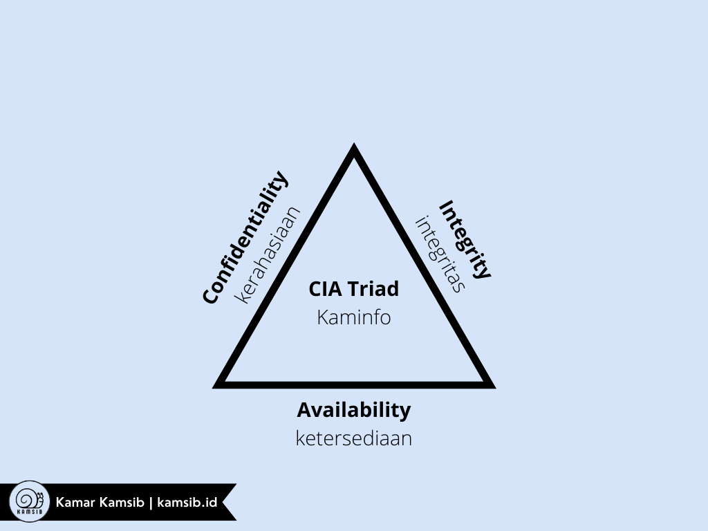

# security-awareness
Mengulas semua materi kesadaran keamanan informasi dan siber dalam bahasa Indonesia yang mudah dipahami.

# 1. Bagaimana saya memulai dari NOL?
Sering kali yang muncul di benak adalah _"Saya mau belajar tentang h4cking, pentesting, manajemen keamanan informasi, dan bahkan cyber security secara umum. Tapi bingung mau mulai darimana?"_ Jawaban dari pertanyaan tersebut adalah _"MULAI DARI KUNJUNGI KAMAR KAMSIB!"_. Tulisan ini akan mengajak teman-teman untuk meningkatkan kesadaran akan pentingnya keamanan informasi di dunia maya.

# 2. Prinsip Keamanan Informasi
> CIA Triad

* Confidentiality (Kerahasiaan): melindungi datadan informasi organisasi dari penyingkapan orang–orang yang tidak berhak 
* Integrity (Integritas): melindungi keutuhan datadan informasi organisasi dari modifikasi yang tidaksah 
* Availability (Ketersediaan): melindungi ketersediaan data dan informasi organisasi, sehingga data tersedia pada saat dibutuhkan

# 3. Mengapa saya harus aware?
Sebagai pribadi, khususnya sebagai salah satu bagian dari instansi/organisasi, kita harus membekali diri kita dengan ilmu dan kesadaran akan keamanan suatu informasi. Bukan hanya mengjadi nilai positif bagi instansi, tapi juga ke diri pribadi. _Siapa sih yang mau berselancar di internet dengan rasa takut?_ Tentu tidak ada kan?
[Insert grafik ancaman dan serangan]

## 3.1 Penerapan Kaminfo dalam Hal Simpel
* Klasifikasi Aset Informasi dan Kerahasiaan Informasi
* Keamanan Fisik
* Keamanan Komputer
* Pengelolaan Kata Sandi (Password)
* Penggunaan Intranet dan Internet, Surat Elektronik, WIFI, dan
* Etika Bersosial Media
* Perangkat Lunak Berlisensi
* Insiden KI dan Kewaspadaan terhadap Malware dan Phising

## 3.2 Klasifikasi Data dan Informasi
> Menurut ~~PMK Nomor 97 Tahun 2017~~ PMK Nomor 133/PMK.01/2022:

* SANGAT RAHASIA
* RAHASIA
* TERBATAS
* PUBLIK

> Menurut Perban BSSN Nomor 8 tahun 2020:

* Sangat Rahasia
* Rahasia dan/ atau Terbatas
* Biasa

## 3.3 Panduan Umum Pengamanan Dokumen
* Jangan membiarkan **dokumen sensitif** terbuka
* Jangan mencetak dokumen sensitif di printer yang diluar jangkauan
* Jangan berbagi informasi sensitif
* Jangan melihat **informasi sensitif** yang bukan kewenangannya
* Jangan menyimpan informasi sensitif di luar fasilitas kedinasan
* Jangan membuang laporan/informasi tanpa dihancurkan terlebih dahulu
* Jangan memberikan aset informasi kepada pihak lain untuk kepentingan di luar kedinasan
* Memberikan **label/kode kerahasiaan** pada amplop pembungkus dokumen sensitif

## 3.4 Macam Pengamanan 
* Pengamanan Area
* Pengamanan Perangkat
* Penggunaan Kata Sandi
* Penggunaan Internet dan Network Internal
* Penggunaan Email
* Penggunaan WIFI
* Pengamanan Media Sosial

# 4. SERANGAN 
## 4.1 RANSOM IS REAL!
**Attacks = Motive (Goal) + Method + Vulnerability**

Motif berasal dari gagasan bahwa sistem target menyimpan atau memproses sesuatu yang berharga, dan ini mengarah pada ancaman serangan terhadap sistem Penyerang.
> Lebih lengkap mengenai RANSOM dapat dilihat di direktori [/ransomware/](https://github.com/kamarkamsib/security-awareness/tree/main/ransomware)

## 4.2 Manusia Lemah Terhadap Beberapa Hal Ini
> Serangan siber yang sering menargetkan manusia.

### 4.2.1 SOCENG: Social Engineering

_"Amatir menyerang sistem. Profesional menyerang manusia."_
Mungkin kalimat tersebut sering terdengar bagi kaum-kaum yang sering nongkrong di bidang keamanan informasi dan siber. Apakah terkesan lebay? Hmmm... Tidak juga. Karena memang pada dasarnya manusia lah yang menjadi mata rantai terlemah dalam sebuah sistem. Salah satu bacaan mengenai Soceng dapat dibaca dalam buku berjudul _"Social Engineering: The Science of Human Hacking 2nd Edition"_ oleh Christopher Hadnagy.

Dalam konteks keamanan informasi, _Social Engineering_ atau Rekayasa Sosial merupakan istilah yang dipakai untuk berbagai aktivitas jahat melalui manipulasi psikologis orang untuk melakukan tindakan atau membocorkan informasi rahasia. Hal ini berbeda dengan rekayasa sosial dalam ilmu sosial, yang tidak menyangkut pengungkapan informasi rahasia.

Simpelnya. Soceng itu **nge-hack manusia**.

> Lebih lengkap mengenai SOCENG dapat dilihat di direktori [/soceng/](https://github.com/kamarkamsib/security-awareness/tree/main/soceng)

###  4.2.2 Phishing

Praktik pengiriman email tidak sah yang mengaku berasal dari situs yang sah dalam upaya untuk memperoleh informasi pribadi atau akun pengguna Web
> Lebih lengkap mengenai PHISHING dapat dilihat di direktori [/phishing/](https://github.com/kamarkamsib/security-awareness/tree/main/phishing)

## 4.3 Serangan Brute-force pada Password

Nanti akan menjelaskan tentang brute force, dictionary, dan rule based attack.

> Lebih lengkap mengenai Indeks KAMI dapat dilihat di direktori [/brute-force/](https://github.com/kamarkamsib/security-awareness/tree/main/brute-force)
> Cek berapa lama password kamu bisa dibobol di [Password Checker SingCERT](https://www.csa.gov.sg/singcert/Resources/Password-Checker)

# 5. INDEKS KAMI
Indeks KAMI adalah alat evaluasi untuk menganalisa tingkat kesiapan pengamanan informasi di suatu organisasi. Alat evaluasi ini tidak ditujukan untuk menganalisa kelayakan atau efektifitas bentuk pengamanan yang ada, melainkan sebagai perangkat untuk memberikan gambaran kondisi kesiapan (kelengkapan dan kematangan) kerangka kerja keamanan informasi kepada pimpinan Instansi/Perusahaan. Evaluasi dilakukan terhadap berbagai area yang menjadi target penerapan keamanan informasi dengan ruang lingkup pembahasan yang juga memenuhi semua aspek keamanan yang didefinisikan oleh standar ISO/IEC 27001:2013.

> Lebih lengkap mengenai Indeks KAMI dapat dilihat di direktori [/Indeks-KAMI/](https://github.com/kamarkamsib/security-awareness/tree/main/Indeks-KAMI)

# 6. Security Awareness dalam Bidang Perbankan
https://media.neliti.com/media/publications/66796-ID-kesadaran-keamanan-informasi-pada-pegawa.pdf
https://www.bca.co.id/-/media/Feature/Report/File/Sustainability-Index/SASB/SASB-FNCB230a1-1-Jumlah-pelanggaran-data-2-persentase-yang-melibatkan-informasi-identitas-pribadi-PI.pdf

# 7. Autentikasi dan Enkripsi
Autentikasi dan enkripsi adalah dua hal yang berbeda. Tapi kedua tekonologi ini saling berkaitan yang membantu memastikan data kita aman. Autentikasi (_authentication_) menurut KBBI adalah proses, cara, perbuatan membuktikan sesuatu secara autentik (dapat dipercaya, asli, tulen, sah). Sedangkan enkripsi (_encryption_) membantu untuk memastikan bahwa informasi di dalam sebuah sistem tidak dimodifikasi.
